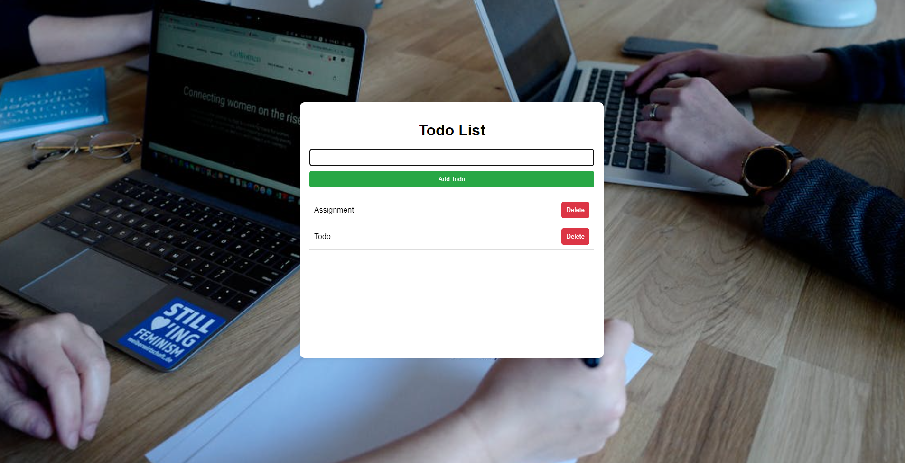
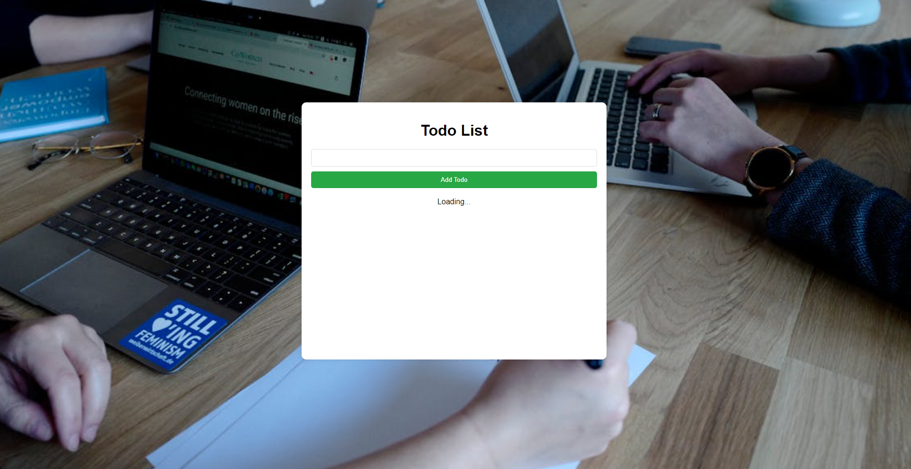

# Todo Application

## Overview

- **Description:** This is a simple Todo application built as a Full Stack project.
- **Backend:** Implemented using Node.js with Express.
- **Database:** AWS DynamoDB.
- **Frontend:** Developed using React.js.

## Features

- Add and delete todo items.
- View a list of all todos.
- Responsive design.

## Technologies Used

- **Frontend:** React.js
- **Backend:** Node.js, Express
- **Database:** AWS DynamoDB
- **Other:** AWS SDK

## Installation

### Prerequisites

- Node.js and npm installed.
- AWS account for DynamoDB.

### Setup

1. **Clone the repository:**

    ```bash
    git clone <repository-url>
    ```

2. **Navigate to the project directory:**

    ```bash
    cd <project-directory>
    ```

3. **Install backend dependencies:**

    ```bash
    cd backend
    npm install
    ```

4. **Install frontend dependencies:**

    ```bash
    cd ../frontend
    npm install
    ```

5. **Set up environment variables:**

    - Create a `.env` file in the `backend` directory.
    - Add the required environment variables for AWS DynamoDB.

6. **Run the application:**

    - **Start the backend server:**

        ```bash
        cd backend
        npm start
        ```

    - **Start the frontend development server:**

        ```bash
        cd ../frontend
        npm start
        ``
